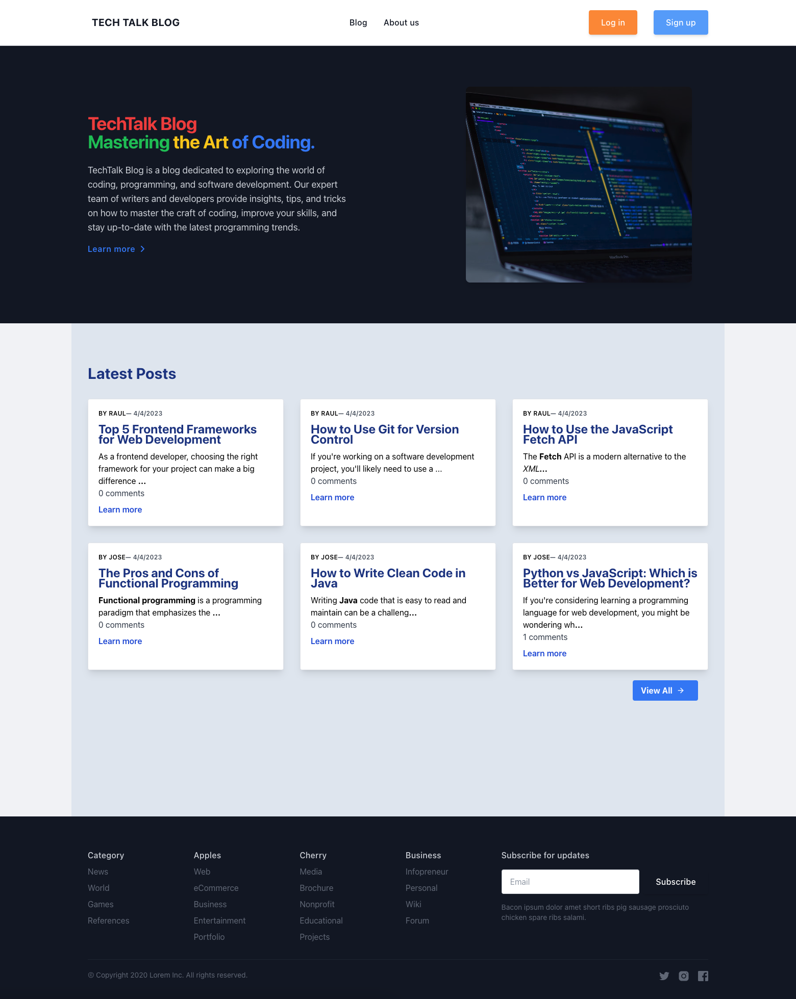
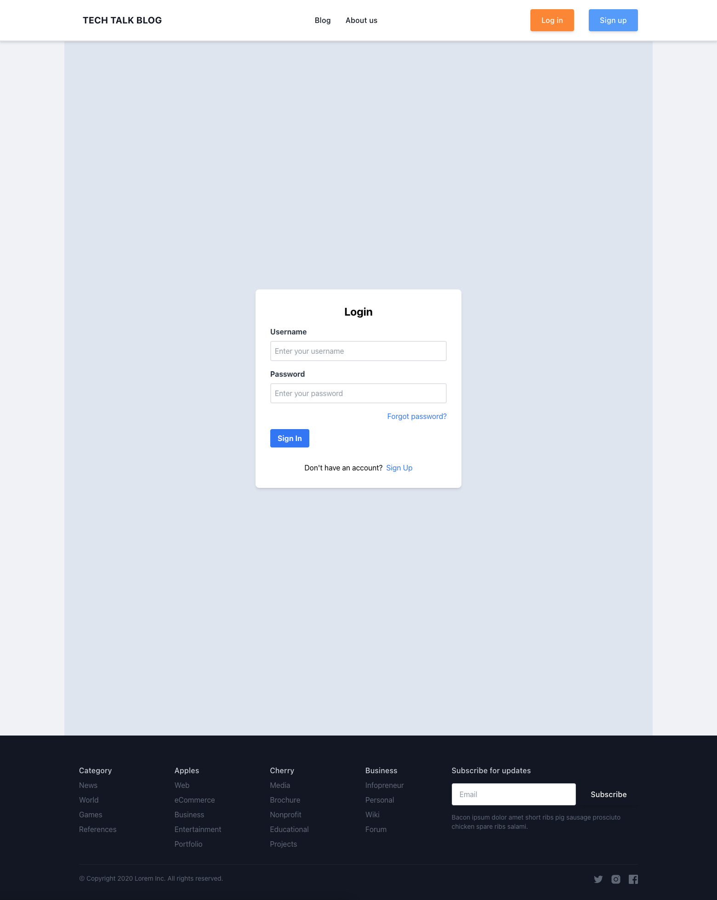
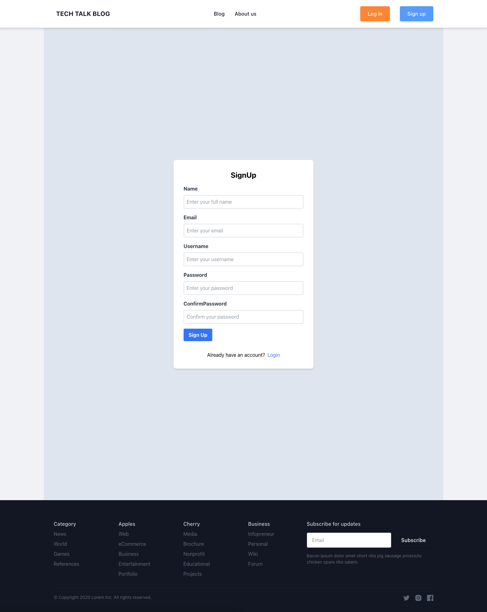
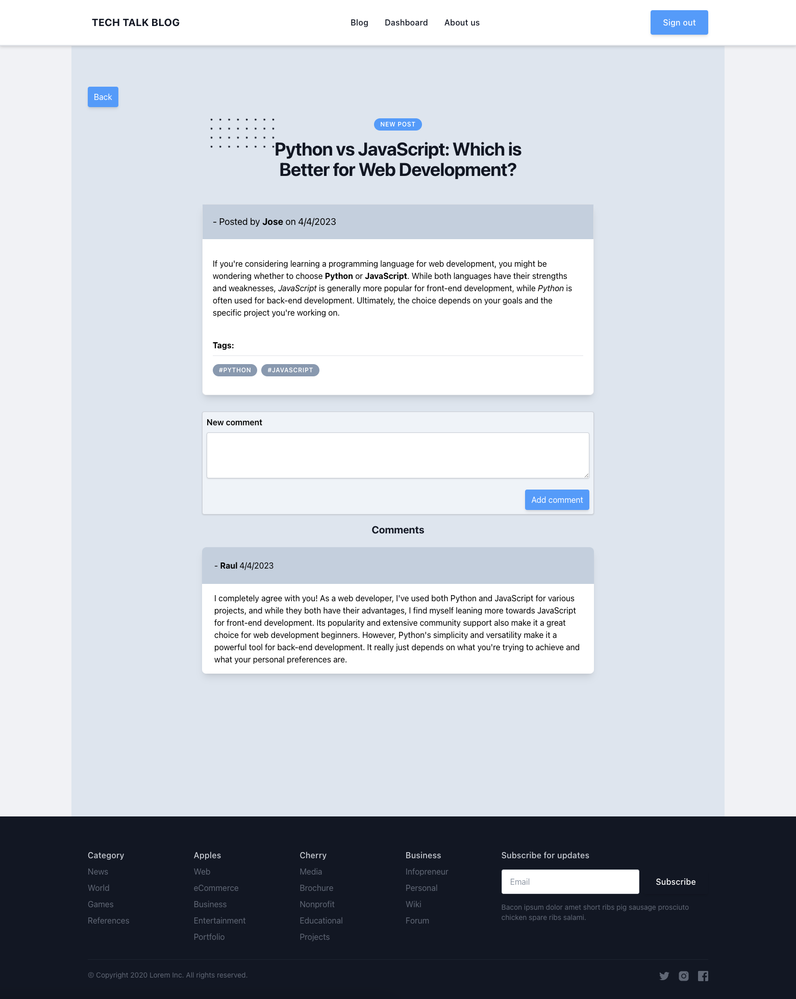
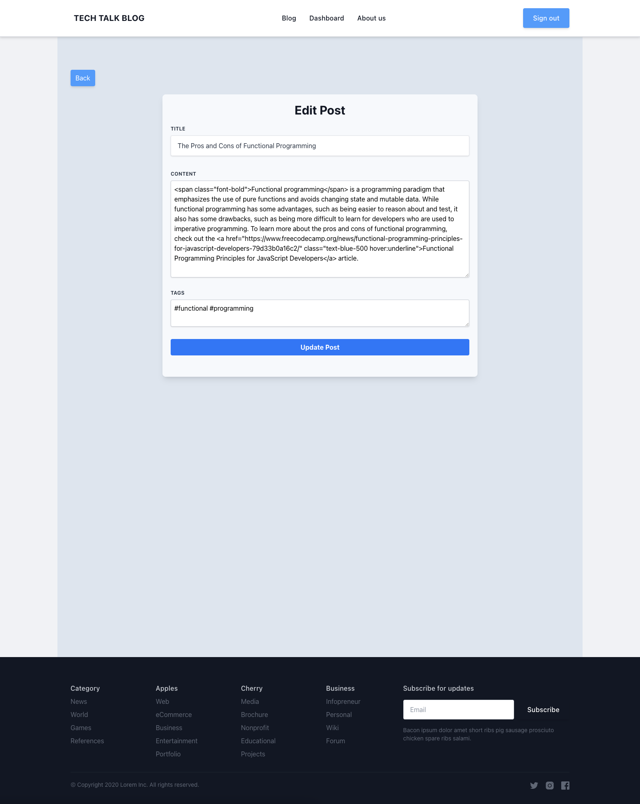
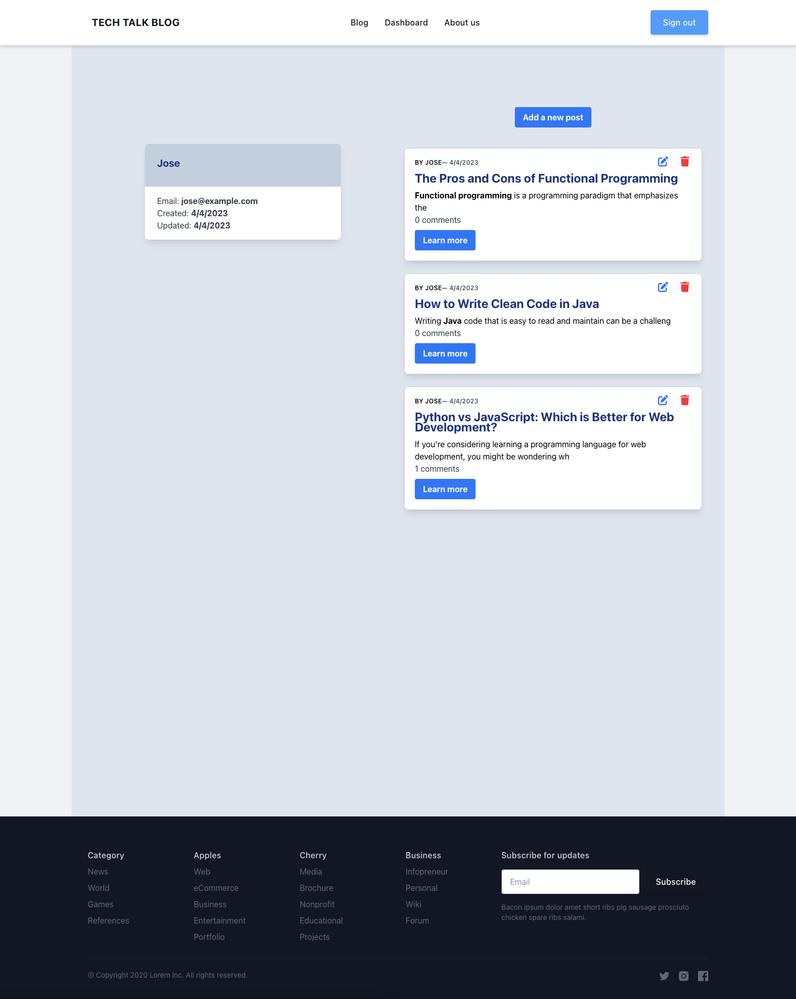
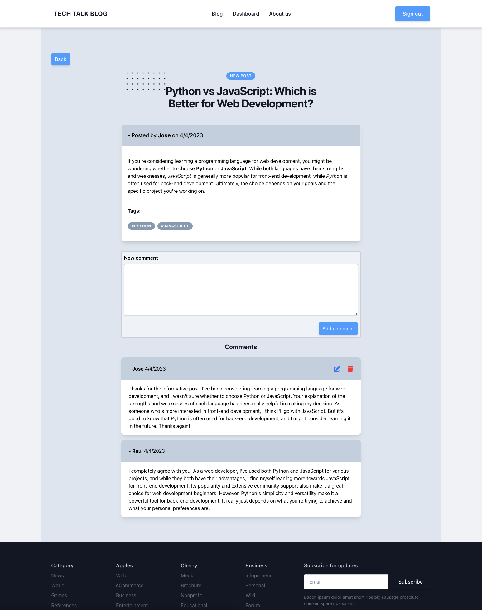
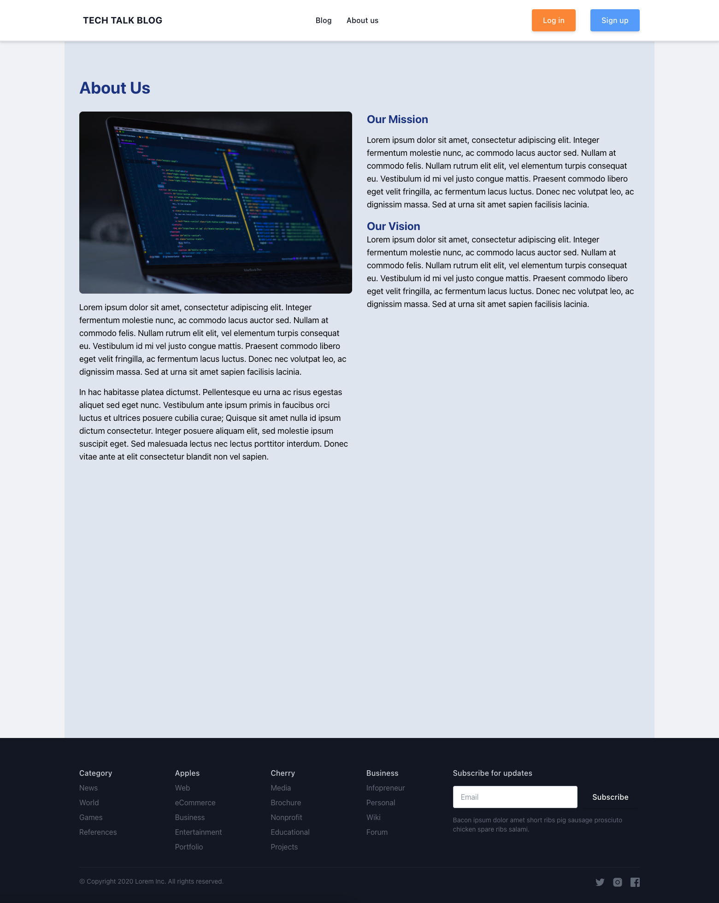

# The TechTalk Blog

TechTalk Blog is a blog dedicated to exploring the world of coding, programming, and software development. It is a place where you can find articles on a variety of topics.

## Click [here](https://illustrious-sprite-a61321.netlify.app/) to view the live application.

## Tech used
- [React](https://reactjs.org/)
- [Redux](https://redux.js.org/)
- [TypeScript](https://www.typescriptlang.org/)
- [Java](https://www.java.com/en/)
- [Spring Boot](https://spring.io/projects/spring-boot)
- [Spring Security](https://spring.io/projects/spring-security)
- [Spring Data JPA](https://spring.io/projects/spring-data-jpa)
- [Spring oAuth2](https://spring.io/projects/spring-security-oauth)
- [Tailwind CSS](https://tailwindcss.com/)
- [Font Awesome](https://fontawesome.com/)
- [REST API](https://restfulapi.net/)
- [MySQL](https://www.mysql.com/)

## Usage

Users can create an account and log in to the application. Once logged in, users can create, edit, and delete posts. Users can also comment on posts. 

## Screenshots

## Questions

Contact me by:    
Email: [jimenezraul1981@gmail.com](mailto:jimenezraul1981@gmail.com)   
LinkedIn: [LinkedIn](https://www.linkedin.com/in/raul-jimenez-778b2a196/)